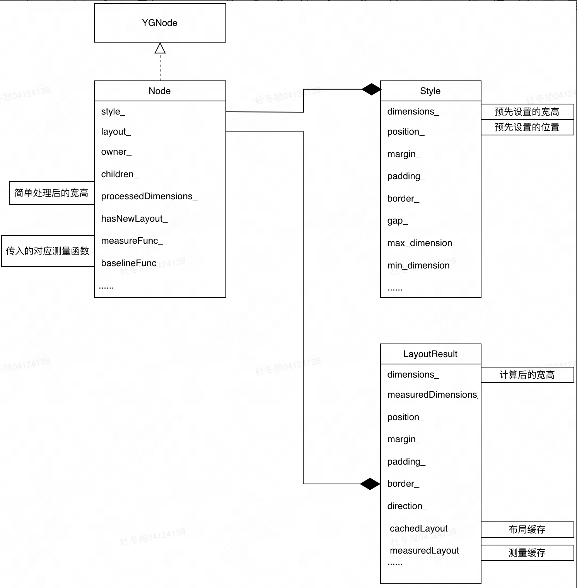
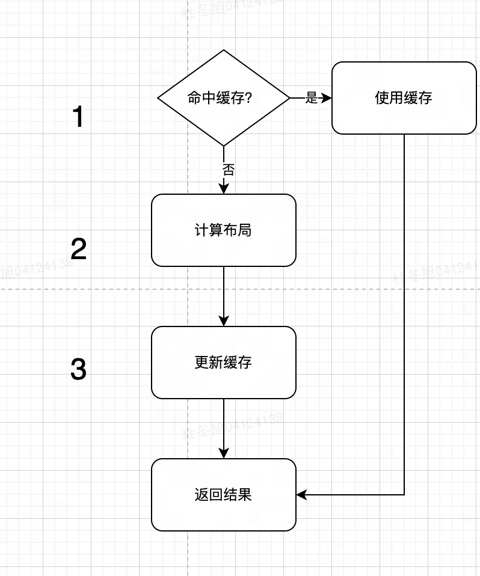
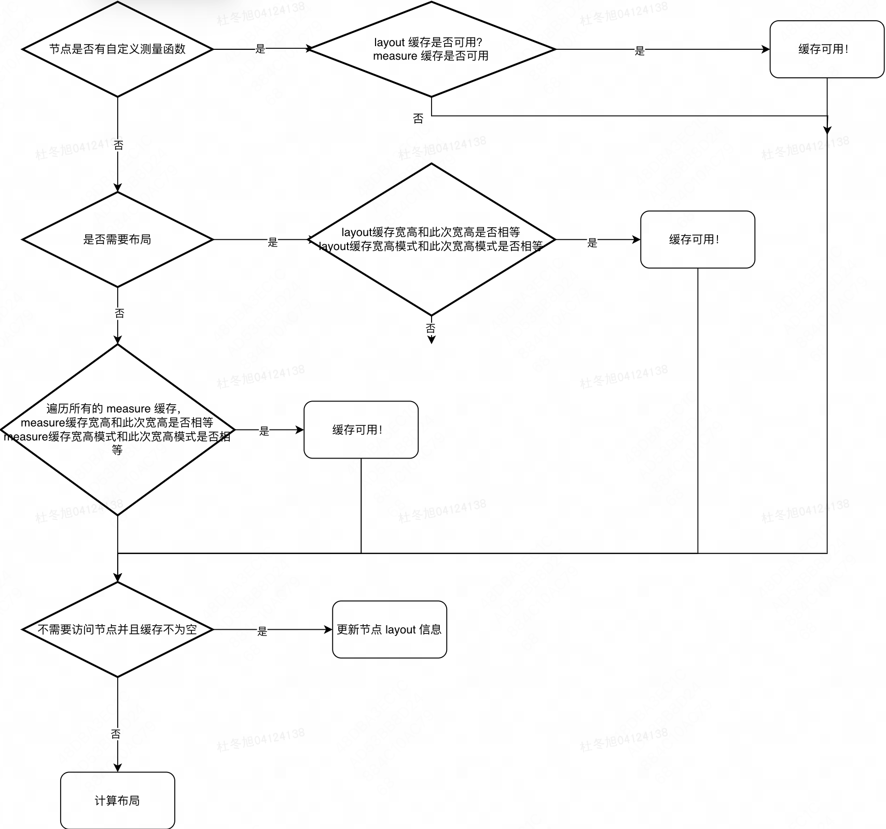
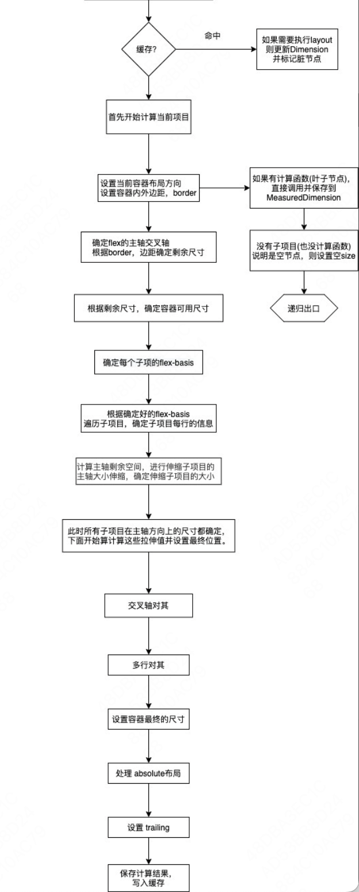
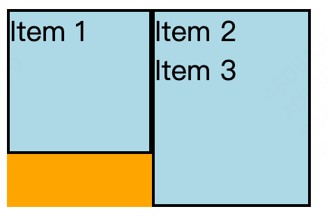
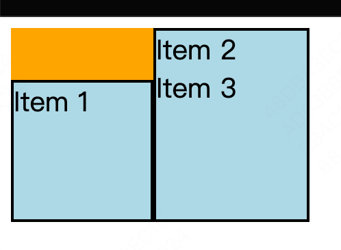

# 结论

yoga测试用例如下:
``` shell
                      root0
                    (Nan,Nan)
                    /         \
            child1              child2
(100,100,margin:10)             (Nan,Nan)  
                                    |
                                    child3
                                   (100,100)
```

```c++
void yoga_test() {
  /**
   * create root
   */
  YGNodeRef root = YGNodeNew();
  YGNodeSetTag(root, 0);
  YGNodeStyleSetDirection(root, YGDirection::YGDirectionLTR);
  YGNodeStyleSetFlexDirection(root, YGFlexDirectionRow);
  // YGNodeStyleSetBoxSizing(root, YGBoxSizing::YGBoxSizingContentBox);

  /**
   * create child1
   */
  YGNodeRef child1 = YGNodeNew();
  YGNodeSetTag(child1, 1);
  YGNodeStyleSetWidth(child1, 100.0);
  YGNodeStyleSetHeight(child1, 100.0);
  YGNodeStyleSetMargin(child1, YGEdge::YGEdgeLeft, 10.0);
  // YGNodeStyleSetFlexBasis(child1, 200.0);
  // YGNodeStyleSetBorder(child1, YGEdge::YGEdgeAll, 10.0);
//   YGNodeStyleSetPadding(child1, YGEdge::YGEdgeAll, 10.0);

  /**
   * create child2
   */
  YGNodeRef child2 = YGNodeNew();
  YGNodeSetTag(child2, 2);
  // YGNodeStyleSetWidth(child2, 110.0);
  // YGNodeStyleSetHeight(child2, 110.0);

  /**
   * create child3
   */
  YGNodeRef child3 = YGNodeNew();
  YGNodeSetTag(child3, 3);
  YGNodeStyleSetWidth(child3, 110.0);
  YGNodeStyleSetHeight(child3, 110.0);

  /**
   * manage child
   */
  YGNodeInsertChild(root, child1, 0);
  YGNodeInsertChild(root, child2, 1);
  YGNodeInsertChild(child2, child3, 0);

  // 设定boxsizing模式为 content-box
  YGNodeStyleSetBoxSizing(root, YGBoxSizing::YGBoxSizingContentBox);
  YGNodeStyleSetBoxSizing(child1, YGBoxSizing::YGBoxSizingContentBox);
  YGNodeStyleSetBoxSizing(child2, YGBoxSizing::YGBoxSizingContentBox);

  /**
   * calculatelayout
   */
  YGNodeCalculateLayout(root, YGUndefined, YGUndefined, YGDirectionLTR);

  /**
   * 递归打印节点信息
   */
  LogNodeLayoutResRecursive(root);

  /**
   * 释放节点
   */
  YGNodeFreeRecursive(root);
}
```

calculate 布局结果如下：
```shell
[ node: 0 x: 0 y: 0 width: 220 height: 110 ]

[ node: 1 x: 10 y: 0 width: 100 height: 100 ]

[ node: 2 x: 110 y: 0 width: 110 height: 110 ]

[ node: 3 x: 0 y: 0 width: 110 height: 110 ]
```

## 1.yoga 布局流程

1. 输入参数与初步判断。函数接受布局的输入参数，如视图的宽度、高度、方向、对齐方式等。一般先判断是否有缓存结果，如果有缓存且可以重用，就直接返回结果，减少重复计算。
2. 递归遍历布局树。视图层级被抽象为树形结构，每个节点代表一个视图。calculateLayoutImpl 会递归调用自身来计算每个节点的布局信息。它在遍历每个子节点时，根据其父节点的宽高、边距、对齐属性等确定子节点的布局参数。

3. 宽高计算。根据 Flexbox 布局规则和节点的尺寸约束计算每个节点的宽高。核心逻辑包含：

 - 主轴与交叉轴计算：根据父节点的方向属性（例如水平或垂直）确定主轴和交叉轴，再分别计算它们的宽高。
 - 尺寸约束：根据 minWidth、maxWidth、minHeight、maxHeight 等限制条件计算出最终的宽高。
 - 空间分配：如果是 flex-grow 或 flex-shrink 元素，会调整尺寸以适应父容器的剩余空间或受限空间。


4. 位置计算。每个节点的最终位置是基于父节点的位置、padding、margin 和 align 属性等决定的。这里常见的流程包括：
 - 计算偏移量：根据对齐方式（如 align-items、justify-content）确定子节点的偏移。
 - 应用偏移与边距：将计算出的偏移量和 margin 应用到节点上，确定其具体的 x、y 坐标。

5. 布局缓存。为避免重复计算，布局结果通常会被缓存到节点对象中。这种缓存可以帮助在同一帧内的重绘过程中重复使用布局信息，从而提升性能。





### 1.1 使用缓存



### 1.2 布局计算



### 1.3 缓存更新

## 1.前置知识
### 1.1 [box-sizing](https://developer.mozilla.org/en-US/docs/Web/CSS/box-sizing)
存在两种模式
1. border-box，是默认的模式，这时候view的实际内容宽度等于分配的宽度减去padding和border
2. content-box，这种模式下，实际内容的宽度就等于分配的宽度，而view的整体宽度则为分配的宽度加上padding和border

```c++
  // 设定boxsizing模式为 content-box
  YGNodeStyleSetBoxSizing(root, YGBoxSizing::YGBoxSizingContentBox);
  YGNodeStyleSetBoxSizing(child1, YGBoxSizing::YGBoxSizingContentBox);
  YGNodeStyleSetBoxSizing(child2, YGBoxSizing::YGBoxSizingContentBox);
```
### 1.2 SizingMode

```c++
  // 指定可用宽高均为 100(注意此宽高非root宽高!而是当前空间的可用宽高)
  YGNodeCalculateLayout(root, 100.0, 100.0, YGDirectionLTR);
```

尺寸模式
1. MaxContent: 未指定可用空间下盒子理想的尺寸模式，通常这种情况是最小的尺寸，但又刚好能包住content
2. StretchFit: 元素会尽可能地填满可用空间，但不会超出限制。
3. FitContent: 
   
| 可用宽 | 可用高 | 宽模式     | 高模式     |
| ------ | ------ | ---------- | ---------- |
| Nan    | Nan    | MaxContent | MaxContent |
| 100.0  | 100.0  | StretchFit | StretchFit |


### 1.3 [flex-basis](https://developer.mozilla.org/en-US/docs/Web/CSS/flex-basis)
指定了 flex 元素在主轴方向上的初始大小。当一个元素同时被设置了 flex-basis (除值为 auto 外) 和 width (或者在 flex-direction: column 情况下设置了height) , flex-basis 具有更高的优先级。


### 1.4 [flex-wrap](https://developer.mozilla.org/en-US/docs/Web/CSS/flex-wrap)

用于设置 flex 项目是强制排在一行还是可以换行到多行。如果允许换行，则设置行的堆叠方向。

1. nowrap: 默认值，弹性项目以单行形式排列，这可能会导致弹性容器溢出。

2. wrap: 弹性项目会分成多行。

3. wrap-reverse:行为与wrap相同，但是起点和终点是颠倒的。

 

### 1.5 [justify-content](https://developer.mozilla.org/zh-CN/docs/Web/CSS/justify-content)

用于定义在主轴（主轴可以是水平或垂直方向，取决于 flex-direction 的值）上如何对齐和分布Flex容器中的项目。


## 2.Calculate

## 2.1 calculateLayoutImpl
整个算法核心，主要计算节点以及子节点的位置和尺寸。

0. 步骤0：前置工作，判断是否可以直接返回

算法开始前检查是否能达成部分条件，达成即可快速返回。

```c++
  // Clean and update all display: contents nodes with a direct path to the
  // current node as they will not be traversed
  // 简而言之,在布局系统中，display: contents
  // 的节点在视觉上不占用空间，而是将其子节点直接展现在父节点的上下文中
  // 因此需要清理下这些节点的布局信息，但并没有在节点树将其移除。
  cleanupContentsNodesRecursively(node);

  // 如果节点有专门的测量函数，直接测量返回。目前已知拥有测量函数的是文本。
  if (node->hasMeasureFunc()) {
    measureNodeWithMeasureFunc(
        node,
        direction,
        availableWidth - marginAxisRow,
        availableHeight - marginAxisColumn,
        widthSizingMode,
        heightSizingMode,
        ownerWidth,
        ownerHeight,
        layoutMarkerData,
        reason);
    return;
  }

  const auto childCount = node->getLayoutChildCount();
  // 没有子节点走此分支，即叶子节点
  if (childCount == 0) {
    logWithColor(
        std::to_string(node->getTag()) +
            "没有子节点，measureNodeWithoutChildren，直接 return",
        Color::YELLOW);
    measureNodeWithoutChildren(
        node,
        direction,
        availableWidth - marginAxisRow,
        availableHeight - marginAxisColumn,
        widthSizingMode,
        heightSizingMode,
        ownerWidth,
        ownerHeight);
    return;
  }

  // 不需要完整布局，并且节点已经有固定的大小也可直接返回。
  
  if (!performLayout &&
      measureNodeWithFixedSize(
          node,
          direction,
          availableWidth - marginAxisRow,
          availableHeight - marginAxisColumn,
          widthSizingMode,
          heightSizingMode,
          ownerWidth,
          ownerHeight)) {
            
    return;
  }
  // At this point we know we're going to perform work. Ensure that each child
  // has a mutable copy.
  // 必要情况下拷贝下孩子,，比如有些child 共享在多个树中
  node->cloneChildrenIfNeeded();
  // Reset layout flags, as they could have changed.
  node->setLayoutHadOverflow(false);
```


1. 步骤1：准备工作，计算整个算法所需要的其他关键值，方便后续计算。

```c++
// 弹性布局主轴
  const FlexDirection mainAxis =
      resolveDirection(node->style().flexDirection(), direction);
  // 弹性布局副轴
  const FlexDirection crossAxis = resolveCrossDirection(mainAxis, direction);
  // 主轴是否是行
  const bool isMainAxisRow = isRow(mainAxis);
  
  const bool isNodeFlexWrap = node->style().flexWrap() != Wrap::NoWrap;
  // 主轴上的宿主长度
  const float mainAxisOwnerSize = isMainAxisRow ? ownerWidth : ownerHeight;
  // 副轴上的宿主长度
  const float crossAxisOwnerSize = isMainAxisRow ? ownerHeight : ownerWidth;

  // 主轴上的padding + border
  const float paddingAndBorderAxisMain =
      paddingAndBorderForAxis(node, mainAxis, direction, ownerWidth);
  // 副轴上的padding + border
  const float paddingAndBorderAxisCross =
      paddingAndBorderForAxis(node, crossAxis, direction, ownerWidth);
  // 副轴上开头的 padding和border
  const float leadingPaddingAndBorderCross =
      node->style().computeFlexStartPaddingAndBorder(
          crossAxis, direction, ownerWidth);
  // 主轴sizing模式
  SizingMode sizingModeMainDim =
      isMainAxisRow ? widthSizingMode : heightSizingMode;
  // 副轴sizing模式
  SizingMode sizingModeCrossDim =
      isMainAxisRow ? heightSizingMode : widthSizingMode;
  
  // row上的padding + border  
  const float paddingAndBorderAxisRow =
      isMainAxisRow ? paddingAndBorderAxisMain : paddingAndBorderAxisCross;
  // column上的padding + border  
  const float paddingAndBorderAxisColumn =
      isMainAxisRow ? paddingAndBorderAxisCross : paddingAndBorderAxisMain;
```

2. 步骤2：计算主轴和副轴上的可用空间
此处一般指排除padding和border后的空间,主要是针对具有确定长度的轴，做一个最大值最小值限制，免得超过范围。

```c++
float availableInnerWidth = calculateAvailableInnerDimension(
      node,
      direction,
      Dimension::Width,
      availableWidth - marginAxisRow,
      paddingAndBorderAxisRow,
      ownerWidth,
      ownerWidth);

//...
availableInnerDim = yoga::maxOrDefined(
        yoga::minOrDefined(availableInnerDim, maxInnerDim), minInnerDim);
```

3. 步骤3：计算主轴上的全部空间

- 如果当前节点未确定宽度，是需要递归子节点来确定的
- 如果当前节点能确定宽度，则不需要递归，直接获取即可。 

```c++
float totalMainDim = 0;
  totalMainDim += computeFlexBasisForChildren(
      node,
      availableInnerWidth,
      availableInnerHeight,
      widthSizingMode,
      heightSizingMode,
      direction,
      mainAxis,
      performLayout,
      layoutMarkerData,
      depth,
      generationCount);

  // 叠加 gap 长度
  if (childCount > 1) {
    totalMainDim +=
        node->style().computeGapForAxis(mainAxis, availableInnerMainDim) *
        static_cast<float>(childCount - 1);
  }

  // 主轴上计算的总长度是否大于可用空间
  const bool mainAxisOverflows =
      (sizingModeMainDim != SizingMode::MaxContent) &&
      totalMainDim > availableInnerMainDim;

  if (isNodeFlexWrap && mainAxisOverflows &&
      sizingModeMainDim == SizingMode::FitContent) {
    sizingModeMainDim = SizingMode::StretchFit;
  }
```

4. 步骤4-7：将 flex 项目转换为 flex 行列 
整体来说，这段代码的目的是为了确保在 Flexbox 布局中，子节点能够根据其样式、可用空间和对齐属性，正确地计算和定位。通过这样的处理，布局能够灵活适应不同的内容和容器大小。

```c++
for (; startOfLineIterator != node->getLayoutChildren().end(); lineCount++) {
    auto flexLine = calculateFlexLine(
        node,
        ownerDirection,
        ownerWidth,
        mainAxisOwnerSize,
        availableInnerWidth,
        availableInnerMainDim,
        startOfLineIterator,
        lineCount);

    printlnFlexLine(flexLine);

    // If we don't need to measure the cross axis, we can skip the entire flex
    // step.
    const bool canSkipFlex =
        !performLayout && sizingModeCrossDim == SizingMode::StretchFit;

    // STEP 5: RESOLVING FLEXIBLE LENGTHS ON MAIN AXIS
    // Calculate the remaining available space that needs to be allocated. If
    // the main dimension size isn't known, it is computed based on the line
    // length, so there's no more space left to distribute.

    bool sizeBasedOnContent = false;
    // If we don't measure with exact main dimension we want to ensure we don't
    // violate min and max
    if (sizingModeMainDim != SizingMode::StretchFit) {
      const auto& style = node->style();
      const float minInnerWidth =
          style
              .resolvedMinDimension(
                  direction, Dimension::Width, ownerWidth, ownerWidth)
              .unwrap() -
          paddingAndBorderAxisRow;
      const float maxInnerWidth =
          style
              .resolvedMaxDimension(
                  direction, Dimension::Width, ownerWidth, ownerWidth)
              .unwrap() -
          paddingAndBorderAxisRow;
      const float minInnerHeight =
          style
              .resolvedMinDimension(
                  direction, Dimension::Height, ownerHeight, ownerWidth)
              .unwrap() -
          paddingAndBorderAxisColumn;
      const float maxInnerHeight =
          style
              .resolvedMaxDimension(
                  direction, Dimension::Height, ownerHeight, ownerWidth)
              .unwrap() -
          paddingAndBorderAxisColumn;

      const float minInnerMainDim =
          isMainAxisRow ? minInnerWidth : minInnerHeight;
      const float maxInnerMainDim =
          isMainAxisRow ? maxInnerWidth : maxInnerHeight;

      std::cout << "node tag: " << node->getTag()
                << ",minInnerMainDim :" << minInnerMainDim
                << ",maxInnerMainDim :" << maxInnerMainDim
                << ",canSkipFlex: " << canSkipFlex << std::endl;
      if (yoga::isDefined(minInnerMainDim) &&
          flexLine.sizeConsumed < minInnerMainDim) {
        availableInnerMainDim = minInnerMainDim;
      } else if (
          yoga::isDefined(maxInnerMainDim) &&
          flexLine.sizeConsumed > maxInnerMainDim) {
        availableInnerMainDim = maxInnerMainDim;
      } else {
        // 可用宽高均为 Nan
        bool useLegacyStretchBehaviour =
            node->hasErrata(Errata::StretchFlexBasis);

        if (!useLegacyStretchBehaviour &&
            ((yoga::isDefined(flexLine.layout.totalFlexGrowFactors) &&
              flexLine.layout.totalFlexGrowFactors == 0) ||
             (yoga::isDefined(node->resolveFlexGrow()) &&
              node->resolveFlexGrow() == 0))) {
          // If we don't have any children to flex or we can't flex the node
          // itself, space we've used is all space we need. Root node also
          // should be shrunk to minimum
          availableInnerMainDim = flexLine.sizeConsumed;
        }

        sizeBasedOnContent = !useLegacyStretchBehaviour;
      }
    }

    if (!sizeBasedOnContent && yoga::isDefined(availableInnerMainDim)) {
      flexLine.layout.remainingFreeSpace =
          availableInnerMainDim - flexLine.sizeConsumed;
    } else if (flexLine.sizeConsumed < 0) {
      // availableInnerMainDim is indefinite which means the node is being sized
      // based on its content. sizeConsumed is negative which means
      // the node will allocate 0 points for its content. Consequently,
      // remainingFreeSpace is 0 - sizeConsumed.
      flexLine.layout.remainingFreeSpace = -flexLine.sizeConsumed;
    }
    // 跳过！
    if (!canSkipFlex) {
      std::cout << "node tag: " << node->getTag() << "解析 flexible 长度"
                << std::endl;
      resolveFlexibleLength(
          node,
          flexLine,
          mainAxis,
          crossAxis,
          direction,
          ownerWidth,
          mainAxisOwnerSize,
          availableInnerMainDim,
          availableInnerCrossDim,
          availableInnerWidth,
          availableInnerHeight,
          mainAxisOverflows,
          sizingModeCrossDim,
          performLayout,
          layoutMarkerData,
          depth,
          generationCount);
    }

    node->setLayoutHadOverflow(
        node->getLayout().hadOverflow() ||
        (flexLine.layout.remainingFreeSpace < 0));

    // STEP 6: MAIN-AXIS JUSTIFICATION & CROSS-AXIS SIZE DETERMINATION

    // At this point, all the children have their dimensions set in the main
    // axis. Their dimensions are also set in the cross axis with the exception
    // of items that are aligned "stretch". We need to compute these stretch
    // values and set the final positions.

    justifyMainAxis(
        node,
        flexLine,
        mainAxis,
        crossAxis,
        direction,
        sizingModeMainDim,
        sizingModeCrossDim,
        mainAxisOwnerSize,
        ownerWidth,
        availableInnerMainDim,
        availableInnerCrossDim,
        availableInnerWidth,
        performLayout);

    // 计算出容器副轴的高度
    float containerCrossAxis = availableInnerCrossDim;
    if (sizingModeCrossDim == SizingMode::MaxContent ||
        sizingModeCrossDim == SizingMode::FitContent) {
      // Compute the cross axis from the max cross dimension of the children.
      containerCrossAxis =
          boundAxis(
              node,
              crossAxis,
              direction,
              flexLine.layout.crossDim + paddingAndBorderAxisCross,
              crossAxisOwnerSize,
              ownerWidth) -
          paddingAndBorderAxisCross;
    }

    // If there's no flex wrap, the cross dimension is defined by the container.
    if (!isNodeFlexWrap && sizingModeCrossDim == SizingMode::StretchFit) {
      flexLine.layout.crossDim = availableInnerCrossDim;
    }

    // As-per https://www.w3.org/TR/css-flexbox-1/#cross-sizing, the
    // cross-size of the line within a single-line container should be bound to
    // min/max constraints before alignment within the line. In a multi-line
    // container, affecting alignment between the lines.
    if (!isNodeFlexWrap) {
      flexLine.layout.crossDim =
          boundAxis(
              node,
              crossAxis,
              direction,
              flexLine.layout.crossDim + paddingAndBorderAxisCross,
              crossAxisOwnerSize,
              ownerWidth) -
          paddingAndBorderAxisCross;
    }

    // STEP 7: CROSS-AXIS ALIGNMENT
    // We can skip child alignment if we're just measuring the container.
    if (performLayout) {
      for (auto child : flexLine.itemsInFlow) {
        float leadingCrossDim = leadingPaddingAndBorderCross;

        // For a relative children, we're either using alignItems (owner) or
        // alignSelf (child) in order to determine the position in the cross
        // axis
        const Align alignItem = resolveChildAlignment(node, child);

        // If the child uses align stretch, we need to lay it out one more
        // time, this time forcing the cross-axis size to be the computed
        // cross size for the current line.
        if (alignItem == Align::Stretch &&
            !child->style().flexStartMarginIsAuto(crossAxis, direction) &&
            !child->style().flexEndMarginIsAuto(crossAxis, direction)) {
          // If the child defines a definite size for its cross axis, there's
          // no need to stretch.
          if (!child->hasDefiniteLength(
                  dimension(crossAxis), availableInnerCrossDim)) {
            float childMainSize =
                child->getLayout().measuredDimension(dimension(mainAxis));
            const auto& childStyle = child->style();
            float childCrossSize = childStyle.aspectRatio().isDefined()
                ? child->style().computeMarginForAxis(
                      crossAxis, availableInnerWidth) +
                    (isMainAxisRow
                         ? childMainSize / childStyle.aspectRatio().unwrap()
                         : childMainSize * childStyle.aspectRatio().unwrap())
                : flexLine.layout.crossDim;

            childMainSize += child->style().computeMarginForAxis(
                mainAxis, availableInnerWidth);

            SizingMode childMainSizingMode = SizingMode::StretchFit;
            SizingMode childCrossSizingMode = SizingMode::StretchFit;
            constrainMaxSizeForMode(
                child,
                direction,
                mainAxis,
                availableInnerMainDim,
                availableInnerWidth,
                &childMainSizingMode,
                &childMainSize);
            constrainMaxSizeForMode(
                child,
                direction,
                crossAxis,
                availableInnerCrossDim,
                availableInnerWidth,
                &childCrossSizingMode,
                &childCrossSize);

            const float childWidth =
                isMainAxisRow ? childMainSize : childCrossSize;
            const float childHeight =
                !isMainAxisRow ? childMainSize : childCrossSize;

            auto alignContent = node->style().alignContent();
            auto crossAxisDoesNotGrow =
                alignContent != Align::Stretch && isNodeFlexWrap;
            const SizingMode childWidthSizingMode =
                yoga::isUndefined(childWidth) ||
                    (!isMainAxisRow && crossAxisDoesNotGrow)
                ? SizingMode::MaxContent
                : SizingMode::StretchFit;
            const SizingMode childHeightSizingMode =
                yoga::isUndefined(childHeight) ||
                    (isMainAxisRow && crossAxisDoesNotGrow)
                ? SizingMode::MaxContent
                : SizingMode::StretchFit;

            calculateLayoutInternal(
                child,
                childWidth,
                childHeight,
                direction,
                childWidthSizingMode,
                childHeightSizingMode,
                availableInnerWidth,
                availableInnerHeight,
                true,
                LayoutPassReason::kStretch,
                layoutMarkerData,
                depth,
                generationCount);
          }
        } else {
          const float remainingCrossDim = containerCrossAxis -
              child->dimensionWithMargin(crossAxis, availableInnerWidth);

          if (child->style().flexStartMarginIsAuto(crossAxis, direction) &&
              child->style().flexEndMarginIsAuto(crossAxis, direction)) {
            leadingCrossDim += yoga::maxOrDefined(0.0f, remainingCrossDim / 2);
          } else if (child->style().flexEndMarginIsAuto(crossAxis, direction)) {
            // No-Op
          } else if (child->style().flexStartMarginIsAuto(
                         crossAxis, direction)) {
            leadingCrossDim += yoga::maxOrDefined(0.0f, remainingCrossDim);
          } else if (alignItem == Align::FlexStart) {
            // No-Op
          } else if (alignItem == Align::Center) {
            leadingCrossDim += remainingCrossDim / 2;
          } else {
            leadingCrossDim += remainingCrossDim;
          }
        }
        // And we apply the position
        child->setLayoutPosition(
            child->getLayout().position(flexStartEdge(crossAxis)) +
                totalLineCrossDim + leadingCrossDim,
            flexStartEdge(crossAxis));
      }
    }

    const float appliedCrossGap = lineCount != 0 ? crossAxisGap : 0.0f;
    totalLineCrossDim += flexLine.layout.crossDim + appliedCrossGap;
    maxLineMainDim =
        yoga::maxOrDefined(maxLineMainDim, flexLine.layout.mainDim);
  }
```

5. 步骤8：
多行的内容对齐，尤其是在跨轴（cross axis）上进行对齐和分布。

```c++
 // STEP 8: MULTI-LINE CONTENT ALIGNMENT
  // currentLead stores the size of the cross dim
  if (performLayout && (isNodeFlexWrap || isBaselineLayout(node))) {
    float leadPerLine = 0;
    float currentLead = leadingPaddingAndBorderCross;

    const float unclampedCrossDim = sizingModeCrossDim == SizingMode::StretchFit
        ? availableInnerCrossDim + paddingAndBorderAxisCross
        : node->hasDefiniteLength(dimension(crossAxis), crossAxisOwnerSize)
        ? node->getResolvedDimension(
                  direction,
                  dimension(crossAxis),
                  crossAxisOwnerSize,
                  ownerWidth)
              .unwrap()
        : totalLineCrossDim + paddingAndBorderAxisCross;

    const float innerCrossDim = boundAxis(
                                    node,
                                    crossAxis,
                                    direction,
                                    unclampedCrossDim,
                                    ownerHeight,
                                    ownerWidth) -
        paddingAndBorderAxisCross;

    const float remainingAlignContentDim = innerCrossDim - totalLineCrossDim;

    const auto alignContent = remainingAlignContentDim >= 0
        ? node->style().alignContent()
        : fallbackAlignment(node->style().alignContent());

    switch (alignContent) {
      case Align::FlexEnd:
        currentLead += remainingAlignContentDim;
        break;
      case Align::Center:
        currentLead += remainingAlignContentDim / 2;
        break;
      case Align::Stretch:
        leadPerLine = remainingAlignContentDim / static_cast<float>(lineCount);
        break;
      case Align::SpaceAround:
        currentLead +=
            remainingAlignContentDim / (2 * static_cast<float>(lineCount));
        leadPerLine = remainingAlignContentDim / static_cast<float>(lineCount);
        break;
      case Align::SpaceEvenly:
        currentLead +=
            remainingAlignContentDim / static_cast<float>(lineCount + 1);
        leadPerLine =
            remainingAlignContentDim / static_cast<float>(lineCount + 1);
        break;
      case Align::SpaceBetween:
        if (lineCount > 1) {
          leadPerLine =
              remainingAlignContentDim / static_cast<float>(lineCount - 1);
        }
        break;
      case Align::Auto:
      case Align::FlexStart:
      case Align::Baseline:
        break;
    }
    Node::LayoutableChildren::Iterator endIterator =
        node->getLayoutChildren().begin();
    for (size_t i = 0; i < lineCount; i++) {
      const Node::LayoutableChildren::Iterator startIterator = endIterator;
      auto iterator = startIterator;

      // compute the line's height and find the endIndex
      float lineHeight = 0;
      float maxAscentForCurrentLine = 0;
      float maxDescentForCurrentLine = 0;
      for (; iterator != node->getLayoutChildren().end(); iterator++) {
        const auto child = *iterator;
        if (child->style().display() == Display::None) {
          continue;
        }
        if (child->style().positionType() != PositionType::Absolute) {
          if (child->getLineIndex() != i) {
            break;
          }
          if (child->isLayoutDimensionDefined(crossAxis)) {
            lineHeight = yoga::maxOrDefined(
                lineHeight,
                child->getLayout().measuredDimension(dimension(crossAxis)) +
                    child->style().computeMarginForAxis(
                        crossAxis, availableInnerWidth));
          }
          if (resolveChildAlignment(node, child) == Align::Baseline) {
            const float ascent = calculateBaseline(child) +
                child->style().computeFlexStartMargin(
                    FlexDirection::Column, direction, availableInnerWidth);
            const float descent =
                child->getLayout().measuredDimension(Dimension::Height) +
                child->style().computeMarginForAxis(
                    FlexDirection::Column, availableInnerWidth) -
                ascent;
            maxAscentForCurrentLine =
                yoga::maxOrDefined(maxAscentForCurrentLine, ascent);
            maxDescentForCurrentLine =
                yoga::maxOrDefined(maxDescentForCurrentLine, descent);
            lineHeight = yoga::maxOrDefined(
                lineHeight, maxAscentForCurrentLine + maxDescentForCurrentLine);
          }
        }
      }
      endIterator = iterator;
      currentLead += i != 0 ? crossAxisGap : 0;

      for (iterator = startIterator; iterator != endIterator; iterator++) {
        const auto child = *iterator;
        if (child->style().display() == Display::None) {
          continue;
        }
        if (child->style().positionType() != PositionType::Absolute) {
          switch (resolveChildAlignment(node, child)) {
            case Align::FlexStart: {
              child->setLayoutPosition(
                  currentLead +
                      child->style().computeFlexStartPosition(
                          crossAxis, direction, availableInnerWidth),
                  flexStartEdge(crossAxis));
              break;
            }
            case Align::FlexEnd: {
              child->setLayoutPosition(
                  currentLead + lineHeight -
                      child->style().computeFlexEndMargin(
                          crossAxis, direction, availableInnerWidth) -
                      child->getLayout().measuredDimension(
                          dimension(crossAxis)),
                  flexStartEdge(crossAxis));
              break;
            }
            case Align::Center: {
              float childHeight =
                  child->getLayout().measuredDimension(dimension(crossAxis));

              child->setLayoutPosition(
                  currentLead + (lineHeight - childHeight) / 2,
                  flexStartEdge(crossAxis));
              break;
            }
            case Align::Stretch: {
              child->setLayoutPosition(
                  currentLead +
                      child->style().computeFlexStartMargin(
                          crossAxis, direction, availableInnerWidth),
                  flexStartEdge(crossAxis));

              // Remeasure child with the line height as it as been only
              // measured with the owners height yet.
              if (!child->hasDefiniteLength(
                      dimension(crossAxis), availableInnerCrossDim)) {
                const float childWidth = isMainAxisRow
                    ? (child->getLayout().measuredDimension(Dimension::Width) +
                       child->style().computeMarginForAxis(
                           mainAxis, availableInnerWidth))
                    : leadPerLine + lineHeight;

                const float childHeight = !isMainAxisRow
                    ? (child->getLayout().measuredDimension(Dimension::Height) +
                       child->style().computeMarginForAxis(
                           crossAxis, availableInnerWidth))
                    : leadPerLine + lineHeight;

                if (!(yoga::inexactEquals(
                          childWidth,
                          child->getLayout().measuredDimension(
                              Dimension::Width)) &&
                      yoga::inexactEquals(
                          childHeight,
                          child->getLayout().measuredDimension(
                              Dimension::Height)))) {
                  calculateLayoutInternal(
                      child,
                      childWidth,
                      childHeight,
                      direction,
                      SizingMode::StretchFit,
                      SizingMode::StretchFit,
                      availableInnerWidth,
                      availableInnerHeight,
                      true,
                      LayoutPassReason::kMultilineStretch,
                      layoutMarkerData,
                      depth,
                      generationCount);
                }
              }
              break;
            }
            case Align::Baseline: {
              child->setLayoutPosition(
                  currentLead + maxAscentForCurrentLine -
                      calculateBaseline(child) +
                      child->style().computeFlexStartPosition(
                          FlexDirection::Column,
                          direction,
                          availableInnerCrossDim),
                  PhysicalEdge::Top);

              break;
            }
            case Align::Auto:
            case Align::SpaceBetween:
            case Align::SpaceAround:
            case Align::SpaceEvenly:
              break;
          }
        }
      }

      currentLead = currentLead + leadPerLine + lineHeight;
    }
  }
```

6. 步骤9：最终尺寸计算
假设当前主轴是行：
- 如果当前指定了宽高，那直接设置就行；
- 如果没有指定宽，是需要根据子节点来计算最终的宽的。由于上一部分我们已经通过 for循环迭代遍历子节点得出所有行中的最大的宽度- maxLineMainDim,因此直接设置就好
- 如果没有指定高，是需要根据子节点来计算最终的高的。由于上一部分我们已经通过 for循环迭代遍历子节点累加得出行高 - totalLineCrossDim，因此加上 padding 和 border 即可
- 最后在调整下 wrap-reverse 的子节点位置
```c++
 // STEP 9: COMPUTING FINAL DIMENSIONS

  node->setLayoutMeasuredDimension(
      boundAxis(
          node,
          FlexDirection::Row,
          direction,
          availableWidth - marginAxisRow,
          ownerWidth,
          ownerWidth),
      Dimension::Width);

  node->setLayoutMeasuredDimension(
      boundAxis(
          node,
          FlexDirection::Column,
          direction,
          availableHeight - marginAxisColumn,
          ownerHeight,
          ownerWidth),
      Dimension::Height);

  // If the user didn't specify a width or height for the node, set the
  // dimensions based on the children.
  if (sizingModeMainDim == SizingMode::MaxContent ||
      (node->style().overflow() != Overflow::Scroll &&
       sizingModeMainDim == SizingMode::FitContent)) {
    // Clamp the size to the min/max size, if specified, and make sure it
    // doesn't go below the padding and border amount.
    node->setLayoutMeasuredDimension(
        boundAxis(
            node,
            mainAxis,
            direction,
            maxLineMainDim,
            mainAxisOwnerSize,
            ownerWidth),
        dimension(mainAxis));

  } else if (
      sizingModeMainDim == SizingMode::FitContent &&
      node->style().overflow() == Overflow::Scroll) {
    node->setLayoutMeasuredDimension(
        yoga::maxOrDefined(
            yoga::minOrDefined(
                availableInnerMainDim + paddingAndBorderAxisMain,
                boundAxisWithinMinAndMax(
                    node,
                    direction,
                    mainAxis,
                    FloatOptional{maxLineMainDim},
                    mainAxisOwnerSize,
                    ownerWidth)
                    .unwrap()),
            paddingAndBorderAxisMain),
        dimension(mainAxis));
  }

  if (sizingModeCrossDim == SizingMode::MaxContent ||
      (node->style().overflow() != Overflow::Scroll &&
       sizingModeCrossDim == SizingMode::FitContent)) {
    // Clamp the size to the min/max size, if specified, and make sure it
    // doesn't go below the padding and border amount.
    node->setLayoutMeasuredDimension(
        boundAxis(
            node,
            crossAxis,
            direction,
            totalLineCrossDim + paddingAndBorderAxisCross,
            crossAxisOwnerSize,
            ownerWidth),
        dimension(crossAxis));

  } else if (
      sizingModeCrossDim == SizingMode::FitContent &&
      node->style().overflow() == Overflow::Scroll) {
    node->setLayoutMeasuredDimension(
        yoga::maxOrDefined(
            yoga::minOrDefined(
                availableInnerCrossDim + paddingAndBorderAxisCross,
                boundAxisWithinMinAndMax(
                    node,
                    direction,
                    crossAxis,
                    FloatOptional{
                        totalLineCrossDim + paddingAndBorderAxisCross},
                    crossAxisOwnerSize,
                    ownerWidth)
                    .unwrap()),
            paddingAndBorderAxisCross),
        dimension(crossAxis));
  }

  // As we only wrapped in normal direction yet, we need to reverse the
  // positions on wrap-reverse.
  if (performLayout && node->style().flexWrap() == Wrap::WrapReverse) {
    // 指定的行的堆叠方式，从上到下，还是从下到上
    for (auto child : node->getLayoutChildren()) {
      if (child->style().positionType() != PositionType::Absolute) {
        child->setLayoutPosition(
            node->getLayout().measuredDimension(dimension(crossAxis)) -
                child->getLayout().position(flexStartEdge(crossAxis)) -
                child->getLayout().measuredDimension(dimension(crossAxis)),
            flexStartEdge(crossAxis));
      }
    }
  }
```

7. 步骤10-11：处理子节点的位置和尺寸
设置常规子节点的尾部位置（trailing positions）和处理绝对定位的子节点。

```c++
if (performLayout) {
    // STEP 10: SETTING TRAILING POSITIONS FOR CHILDREN
    // 检查是否需要设置主轴或者副轴上尾部的 margin
    const bool needsMainTrailingPos = needsTrailingPosition(mainAxis);
    const bool needsCrossTrailingPos = needsTrailingPosition(crossAxis);

    if (needsMainTrailingPos || needsCrossTrailingPos) {
      for (auto child : node->getLayoutChildren()) {
        // Absolute children will be handled by their containing block since we
        // cannot guarantee that their positions are set when their parents are
        // done with layout.
        if (child->style().display() == Display::None ||
            child->style().positionType() == PositionType::Absolute) {
          continue;
        }
        if (needsMainTrailingPos) {
          setChildTrailingPosition(node, child, mainAxis);
        }

        if (needsCrossTrailingPos) {
          setChildTrailingPosition(node, child, crossAxis);
        }
      }
    }

    // STEP 11: SIZING AND POSITIONING ABSOLUTE CHILDREN
    // Let the containing block layout its absolute descendants.
    if (node->style().positionType() != PositionType::Static ||
        node->alwaysFormsContainingBlock() || depth == 1) {
      layoutAbsoluteDescendants(
          node,
          node,
          isMainAxisRow ? sizingModeMainDim : sizingModeCrossDim,
          direction,
          layoutMarkerData,
          depth,
          generationCount,
          0.0f,
          0.0f,
          availableInnerWidth,
          availableInnerHeight);
    }
  }
```